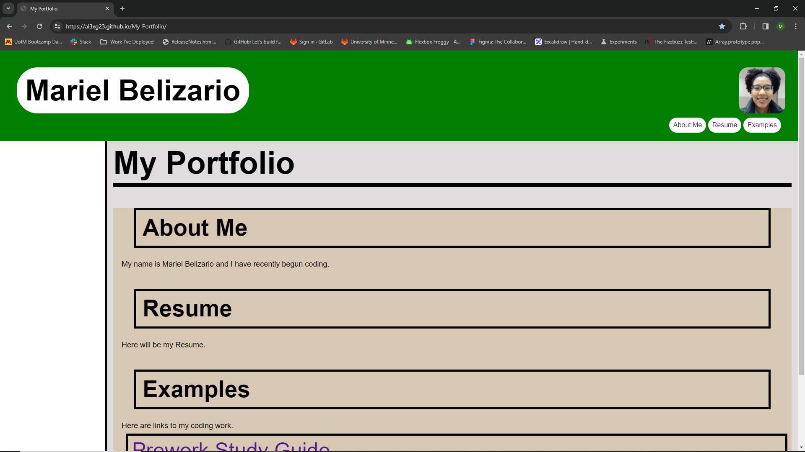

# My-Portfolio

## Description

The purpose of my portfolio is to showcase my coding experience. 
I created my portfolio to display links to my completed works and list my credentials to anyone who would look me up.

<!-- ## Installation -->

## Usage

With this Portfolio, you can navigate to websites I have created. These will show examples of my technical abilities. 
You can also read a blurb about me.

<!-- ## Credits -->

## License

Please Refer to the LICENSE in the repo.